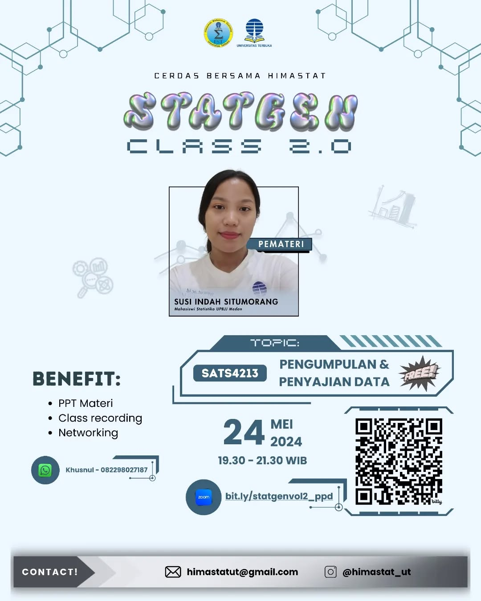

--- 
title: SATS4213 - Pertemuan 4
date: 2024-05-24
icon: chart-bar
author:
  - name: "Firmansyah Mukti Wijaya"
    email: "ikimukti@gmail.com"
    url: "https://ikimukti.com"
  - name: "Himastatut Docs"
    email: "himastatut@gmail.com"
    url: "https://himastatut.my.id/article/"
tags:
  - statistika
  - statgenclass2024
category: 
- STATGEN
--- 

# Pengumpulan & Penyajian Data (SATS4213) Pertemuan 4

## Detil Pertemuan

- **Hari/Tanggal**: Jumat, 24 Mei 2024  
- **Waktu**: 19.30 WIB - Selesai  
- **Topik**: Modus, Median, Kuartil, Persentil, dan Varians  
- **Moderator**: Kak Susi Indah Situmorang (Mahasiswi Statistika Universitas Terbuka Medan)  
- **Pemateri**: Kak Susi Indah Situmorang (Mahasiswi Statistika Universitas Terbuka Medan)

### Ringkasan Materi
Pada pertemuan keempat ini, materi yang dibahas adalah:
1. **Modus**: Penentuan modus dalam data berkelompok, serta cara menghitungnya menggunakan rumus frekuensi kelas.
2. **Median**: Proses mencari kelas median dan cara menghitung median dalam data berkelompok.
3. **Kuartil dan Persentil**: Penentuan kuartil (Q1, Q2, Q3) dan persentil dalam distribusi data serta cara menghitungnya.
4. **Varians dan Deviasi Standar**: Konsep dan perhitungan varians dan deviasi standar sebagai ukuran penyebaran data.

### Video Rekaman Kelas
Tonton rekaman **StatGen Class 2.0 - Pengumpulan & Penyajian Data (SATS4213) Pertemuan 4** di bawah ini untuk pemahaman lebih lanjut:

<VidStack  
  src="https://www.youtube.com/watch?v=odfVXAabpLs"  
  title="StatGen Class 2.0 - Pengumpulan & Penyajian Data (SATS4213) Pertemuan 4"
/>

--- 

## Update Instagram: StatGen Class Vol. 2.0

Siap-siap untuk mengikuti **StatGen Class Vol. 2.0** yang akan datang! Kali ini, kelas ini khusus untuk **Mata Kuliah Pengumpulan dan Penyajian Data (SATS4213)** yang pastinya sangat berguna untuk memperdalam materi perkuliahan.

### Informasi Kelas:

- **Pemateri**: Kak Susi Indah Situmorang
- **Tanggal**: 24 Mei 2024
- **Waktu**: 19.30 WIB
- **Topik**: Pengumpulan dan Penyajian Data

Jangan sampai ketinggalan, yuk! Daftarkan dirimu melalui link di bawah ini:

[Daftar Sekarang!](https://bit.ly/statgenvol2_ppd)

Jangan lupa untuk melihat poster acara **StatGen Class Vol. 2.0** di Instagram dan ikut meramaikan dengan hashtag #statgenclass #kelasonline #webinar

[**Instagram Post - StatGen Class Vol. 2.0**](https://www.instagram.com/p/C7U_YhtyBmw/?img_index=1)

Ayo, gabung dan bawa pertanyaan seputar mata kuliah **SATS4213** ke kelas, kita belajar bareng! 💡

--- 

"Tidak ada kata terlambat untuk belajar. Maka dari itu, mari cerdas bersama Himastat!"

#statgenclass2024 #sigma

<GitContributors />
<GitChangelog />