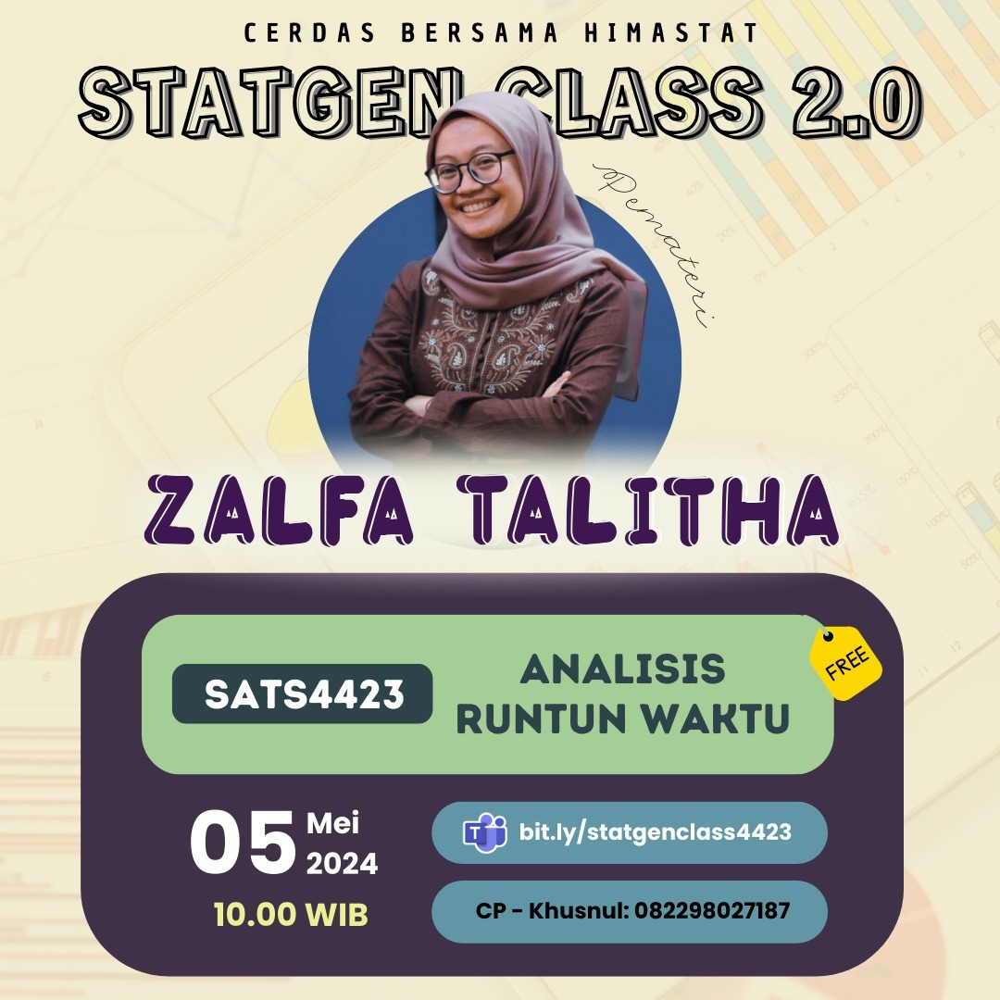

--- 
title: SATS4423 - Pertemuan 1
date: 2024-05-05
icon: chart-bar
author:
  - name: "Firmansyah Mukti Wijaya"
    email: "ikimukti@gmail.com"
    url: "https://ikimukti.com"
  - name: "Himastatut Docs"
    email: "himastatut@gmail.com"
    url: "https://himastatut.my.id/article/"
tags:
  - statistika
  - statgenclass2024
category: 
- STATGEN
--- 

# Analisis Runtun Waktu (SATS4423) Pertemuan 1

## Detil Pertemuan

- **Hari/Tanggal**: Minggu, 5 Mei 2024  
- **Waktu**: 10.00 - Selesai WIB  
- **Topik**: Pengantar dan Konsep Dasar Analisis Runtun Waktu  
- **Moderator**: Kak Zalfa Talitha (Mahasiswi Statistika Universitas Terbuka)  
- **Pemateri**: Kak Zalfa Talitha (Mahasiswi Statistika Universitas Terbuka)

### Ringkasan Materi
Pada pertemuan pertama ini, materi yang dibahas meliputi:
1. **Pengertian Analisis Runtun Waktu**: Konsep dasar analisis data yang diukur sepanjang waktu untuk mengidentifikasi pola dan memprediksi kejadian di masa depan.
2. **Komponen Runtun Waktu**: Memahami komponen seperti tren, musiman, siklus, dan fluktuasi acak dalam data runtun waktu.
3. **Model ARIMA**: Penjelasan mengenai model Autoregressive Integrated Moving Average (ARIMA) dan bagaimana ia digunakan dalam analisis runtun waktu.
4. **Estimasi Parameter ARIMA**: Proses memilih dan mengestimasi parameter dalam model ARIMA melalui analisis data yang ada.
5. **Visualisasi dan Interpretasi Data**: Cara membuat plot data runtun waktu untuk melihat pola dan hubungan antar data.

### Video Rekaman Kelas
Tonton rekaman **StatGen Class 2.0 - Analisis Runtun Waktu (SATS4423) Pertemuan 1** di bawah ini untuk pemahaman lebih lanjut:

<VidStack  
  src="https://www.youtube.com/watch?v=18b2zSt2ohU"  
  title="StatGen Class 2.0 - Analisis Runtun Waktu (SATS4423) Pertemuan 1"
/>

--- 

## Update Instagram: StatGen Class Vol. 2.0

Siap-siap untuk mengikuti **StatGen Class Vol. 2.0** yang akan datang! Kali ini, kelas ini khusus untuk **Mata Kuliah Analisis Runtun Waktu (SATS4423)** yang pastinya sangat berguna untuk memperdalam materi perkuliahan.

### Informasi Kelas:

- **Pemateri**: Kak Zalfa Talitha
- **Tanggal**: 5 Mei 2024
- **Waktu**: 10.00 WIB
- **Topik**: Analisis Runtun Waktu

Jangan sampai ketinggalan, yuk! Daftarkan dirimu melalui link di bawah ini:

[Daftar Sekarang!](https://bit.ly/statgenclass4423)

Jangan lupa untuk melihat poster acara **StatGen Class Vol. 2.0** di Instagram dan ikut meramaikan dengan hashtag #statgenclass #kelasonline #webinar

[**Instagram Post - StatGen Class Vol. 2.0**](https://www.instagram.com/p/C6jPjM5yCLv/?img_index=1)

Ayo, gabung dan bawa pertanyaan seputar mata kuliah **SATS4423** ke kelas, kita belajar bareng! 💡

--- 

"Tidak ada kata terlambat untuk belajar. Maka dari itu, mari cerdas bersama Himastat!"

#statgenclass2024 #sigma

## Bagikan
<Share colorful />
<GitContributors />
<GitChangelog />