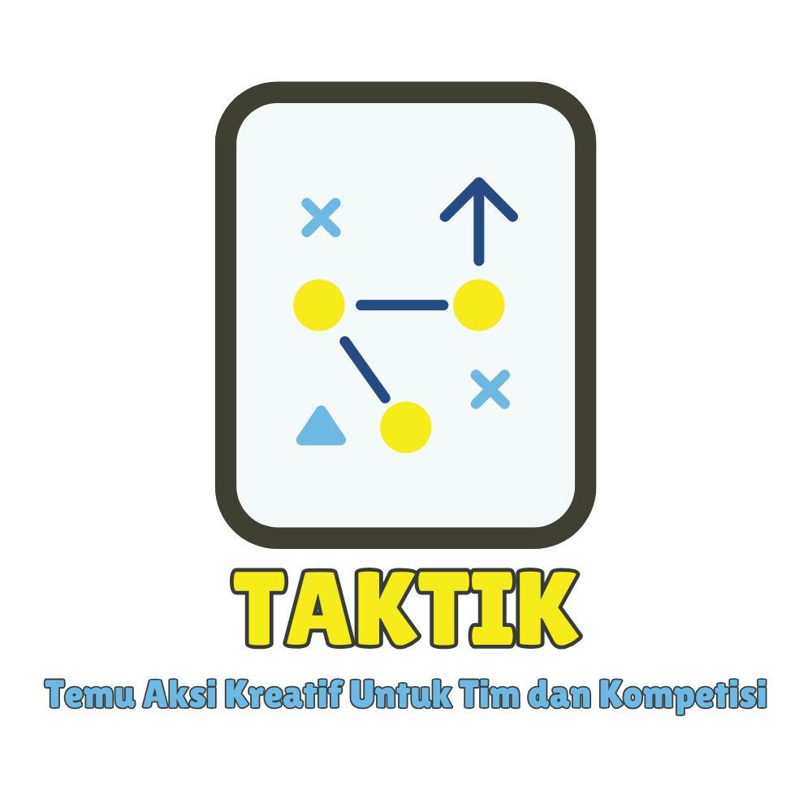
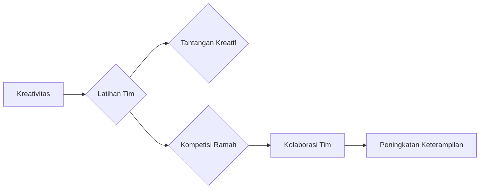

--- 
title: TAKTIK (Temu Aksi Kreatif untuk Tim dan Kompetisi)
index: true
icon: lightbulb
category:
  - TAKTIK
date: 2025-03-16
author:
  - name: "Firmansyah Mukti Wijaya"
    email: "ikimukti@gmail.com"
    url: "https://ikimukti.com"
  - name: "Himastatut Docs"
    email: "himastatut@gmail.com"
    url: "https://himastatut.my.id/article/"
--- 

# TAKTIK - Temu Aksi Kreatif untuk Tim dan Kompetisi

Selamat datang di program **TAKTIK**! Program ini dirancang untuk meningkatkan kreativitas dan daya saing di antara mahasiswa melalui berbagai kegiatan yang memfasilitasi kolaborasi, inovasi, dan pemecahan masalah secara tim. Berikut adalah rincian dan struktur program ini.

## Gambaran Umum Program

**TAKTIK** (Temu Aksi Kreatif untuk Tim dan Kompetisi) adalah program yang bertujuan untuk meningkatkan kreativitas dan kolaborasi di antara mahasiswa. Program ini mengorganisir berbagai kegiatan yang menantang peserta untuk bekerja sama, berpikir kreatif, dan berkompetisi dalam lingkungan yang menyenangkan dan memotivasi. Dengan mendorong inovasi dan kerja tim, **TAKTIK** mempersiapkan mahasiswa untuk menghadapi berbagai tantangan dalam bidang akademik dan ekstrakurikuler.

## Tujuan
- Mendorong kreativitas dan inovasi di kalangan mahasiswa melalui kegiatan berbasis tim.
- Membangun keterampilan kolaborasi dan kerja sama yang lebih kuat di dalam komunitas mahasiswa Statistika.
- Mengorganisir kompetisi yang bersifat ramah dan kolaboratif untuk meningkatkan kemampuan pemecahan masalah dan daya saing.
- Mempersiapkan mahasiswa untuk terlibat dalam kompetisi akademik dan ekstrakurikuler dengan pola pikir kreatif.

## Rincian Program
- **Sasaran**: Mahasiswa Statistika yang tertarik pada kegiatan kerja tim dan kreativitas.
- **Kegiatan**: Berbagai latihan membangun tim, tantangan kreatif, dan kompetisi.
- **Kompetisi**: Kompetisi yang ramah dan kolaboratif dirancang untuk menginspirasi pemikiran inovatif dan kerja sama tim.
- **Hasil**: Peserta mengembangkan kreativitas, keterampilan pemecahan masalah, dan kolaborasi tim yang lebih baik.

### Fitur Program
- **Kreativitas**: Mengikuti kegiatan pemecahan masalah kreatif untuk menginspirasi pemikiran di luar kebiasaan.
- **Kerja Tim**: Membangun keterampilan kolaborasi dan komunikasi yang kuat dalam tim.
- **Daya Saing**: Mendorong kompetisi yang sehat untuk memotivasi peserta agar berprestasi lebih baik.

## Struktur Program
### 1. **Latihan Kreatif**
- Kegiatan yang memfokuskan pada pemecahan masalah secara kreatif dalam kelompok.

### 2. **Kompetisi Ramah**
- Kompetisi yang dirancang untuk menantang kemampuan berpikir inovatif sambil tetap menjaga kolaborasi tim.

### 3. **Pengembangan Keterampilan Kolaborasi**
- Mahasiswa akan terlibat dalam proyek bersama untuk mengasah keterampilan komunikasi dan kolaborasi dalam tim.

### 4. **Kompetisi dan Kolaborasi**
- Setelah pelatihan, peserta akan berkompetisi dalam beberapa tantangan untuk mempraktikkan kreativitas dan kolaborasi yang telah mereka pelajari.

## Visualisasi Program

> **Infografis**: Program TAKTIK menunjukkan tahapan kreatif yang dilalui peserta, dari latihan hingga kompetisi yang berkolaborasi.

### Visualisasi Struktur Program

<GitContributors />
<GitChangelog />