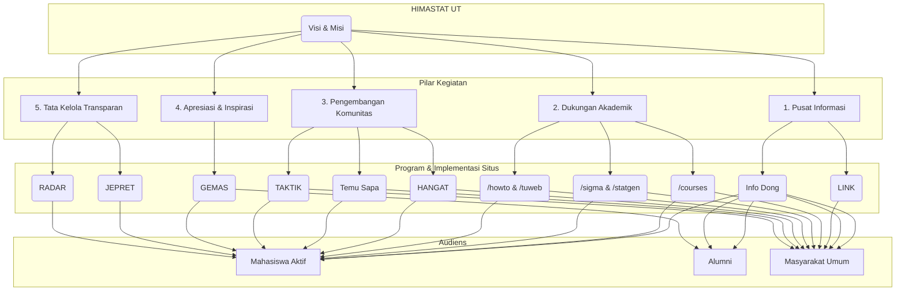

# Mengenal Himpunan Mahasiswa Statistika (HIMASTAT) Universitas Terbuka

Selamat datang di pusat informasi Himpunan Mahasiswa Statistika (HIMASTAT) Universitas Terbuka. Kami adalah organisasi kemahasiswaan resmi yang menjadi rumah bagi seluruh mahasiswa Program Studi Statistika di bawah naungan Fakultas Sains dan Teknologi (FST) Universitas Terbuka.

Halaman ini bertujuan untuk memberikan gambaran utuh mengenai identitas, tujuan, dan struktur organisasi kami. Berlandaskan nilai **transparansi, akuntabilitas, dan apresiasi**, kami berupaya menjadi fasilitator utama bagi pengembangan akademik dan komunitas, tidak hanya untuk mahasiswa aktif, tetapi juga bagi para alumni dan masyarakat umum yang memiliki ketertarikan pada bidang statistika.

## Visi & Misi

### Visi
"Menjadi Himpunan Mahasiswa Statistika yang unggul, inovatif, dan inklusif, serta berperan aktif sebagai pusat sumber daya akademik dan pengembangan komunitas yang transparan dan akuntabel bagi seluruh mahasiswa Statistika Universitas Terbuka."

### Misi
Untuk mencapai visi tersebut, kami berkomitmen untuk:
-   **Menyediakan Informasi Terpusat:** Menjadi sumber utama informasi terkini dan akurat mengenai perkuliahan, kegiatan akademik, dan pengumuman penting melalui kanal terpadu.
-   **Memberikan Dukungan Akademik Komprehensif:** Menyediakan materi perkuliahan, tutorial, dan kelompok belajar yang terstruktur untuk membantu mahasiswa meraih keberhasilan akademik.
-   **Membangun Komunitas yang Solid dan Terkoneksi:** Menciptakan ruang interaksi yang positif dan suportif untuk membangun jaringan antara mahasiswa, pengurus, dan alumni.
-   **Mengapresiasi Prestasi dan Mendorong Inspirasi:** Secara aktif memberikan penghargaan atas pencapaian mahasiswa dan alumni untuk menumbuhkan lingkungan yang memotivasi.
-   **Menjamin Tata Kelola Organisasi yang Transparan:** Memastikan seluruh informasi terkait kepengurusan, program kerja, dan evaluasi dapat diakses dengan mudah oleh seluruh anggota sebagai bentuk akuntabilitas.

## Pilar Utama Kegiatan HIMASTAT UT

Seluruh program kerja kami dirancang untuk berjalan sinergis di bawah lima pilar utama yang mencerminkan fungsi dan tujuan HIMASTAT UT.

### 1. Pusat Informasi Terpadu
Kami percaya bahwa akses informasi yang mudah adalah kunci keberhasilan studi. Pilar ini berfokus pada penyebaran informasi yang cepat, relevan, dan terstruktur.
-   **Info Dong:** Sebagai kanal informasi utama, halaman ini berisi beragam kategori berita, mulai dari pengumuman akademik, informasi acara dan kegiatan, hingga berita khusus HIMASTAT dan alumni.
-   **LINK (Lingkar Informasi & Koneksi):** Program ini memastikan tidak ada informasi yang terlewat dengan menyajikan rangkuman informasi penting secara berkala setiap bulan.

### 2. Dukungan Akademik Komprehensif
Menyadari tantangan dalam sistem pembelajaran jarak jauh, kami menyediakan ekosistem dukungan akademik yang kaya dan beragam.
-   **Materi Perkuliahan (`/courses`):** Kami mengelola repositori materi yang sangat lengkap untuk setiap mata kuliah, terorganisir per semester (Semester 1 hingga 8) untuk memudahkan akses.
-   **Kelompok Belajar (`/sigma` & `/statgen`):** Program seperti **SIGMA** dan **STATGEN** menyediakan forum belajar yang lebih fokus untuk mata kuliah spesifik, lengkap dengan materi pertemuan dan diskusi.
-   **Tutorial & Webinar (`/tuweb` & `/webinarseries`):** Arsip lengkap dari sesi tutorial webinar (TuWeb) dan seri webinar lainnya yang dapat diakses kapan saja untuk pendalaman materi.
-   **Panduan Praktis (`/howto`):** Kumpulan tutorial bermanfaat yang mendukung perkuliahan, seperti cara memanfaatkan email mahasiswa untuk mendapatkan akses gratis ke software (Office 365, SAS, GitHub Education) dan panduan teknis lainnya.

### 3. Pengembangan Komunitas & Jaringan
Kami berupaya memecah batasan geografis dengan program yang dirancang untuk membangun interaksi dan rasa kebersamaan.
-   **HANGAT (Himpunan Akrab & Terkoneksi):** Program ini secara aktif membangun komunitas melalui grup WhatsApp dan platform lainnya untuk memfasilitasi diskusi dan sosialisasi antar mahasiswa.
-   **Temu Sapa (`/temusapa`):** Sesi interaktif yang diadakan secara berkala untuk mempertemukan mahasiswa dengan pengurus maupun sesama anggota dalam suasana yang lebih santai.
-   **TAKTIK (Tanya Jawab Asyik seputar Statistika):** Wadah tanya jawab interaktif untuk membahas berbagai topik terkait statistika, baik akademik maupun non-akademik.

### 4. Apresiasi dan Inspirasi
Motivasi adalah bahan bakar utama. Pilar ini didedikasikan untuk merayakan pencapaian dan berbagi kisah sukses.
-   **GEMAS (Gempita Mahasiswa Statistika):** Program ini secara khusus memberikan penghargaan, menyorot pencapaian inspiratif, dan menampilkan kisah perjalanan alumni untuk memotivasi mahasiswa lainnya.

### 5. Tata Kelola Organisasi yang Transparan
Kepercayaan dibangun di atas transparansi. Kami berkomitmen untuk menjalankan organisasi secara terbuka dan akuntabel.
-   **JEPRET (Jejak Pengurus di Feed Terupdate):** Program ini adalah wujud transparansi kepemimpinan kami. Melalui JEPRET, kami memperkenalkan pengurus yang sedang menjabat dan memberikan apresiasi tulus kepada pengurus terdahulu atas kontribusinya.
-   **RADAR (Rapat dan Evaluasi Berkala):** Sebagai mekanisme kontrol internal, program ini memastikan semua kegiatan dievaluasi secara rutin untuk perbaikan berkelanjutan.

## Visualisasi Struktur Fungsi HIMASTAT UT

Diagram berikut menggambarkan bagaimana kelima pilar kegiatan kami terintegrasi untuk melayani seluruh komunitas HIMASTAT UT.

## Mari Berkontribusi!

Website dan seluruh program HIMASTAT UT adalah milik kita bersama. Kami sangat terbuka bagi siapa saja yang ingin berkontribusi dalam bentuk tulisan, materi, maupun ide.

➡️ **[Pelajari Cara Berkontribusi di Sini](howto/contributes/)**

## Kontak Kami
Jika ada pertanyaan, saran, atau ingin bergabung dengan kami, jangan ragu untuk menghubungi kami melalui:
-   Email: [himastatut@gmail.com](mailto:himastatut@gmail.com)
-   Media Sosial: [Instagram](https://instagram.com/himastatut), [Facebook](https://facebook.com/himastatut), [Twitter](https://twitter.com/himastat_ut)
-   Website: [himastatut.my.id](https://himastatut.my.id)

## Terima Kasih Telah Mengunjungi Kami!
Kami berharap informasi ini bermanfaat bagi Anda. HIMASTAT UT selalu berkomitmen untuk menjadi rumah yang inklusif dan mendukung bagi seluruh mahasiswa Statistika Universitas Terbuka. Mari bersama-sama membangun komunitas yang lebih baik!

---
## Bagikan
<Share colorful />
<GitContributors />
<GitChangelog />
