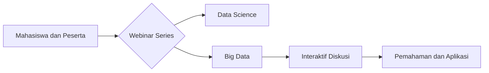

--- 
title: Webinar Series Statistika FST UT
index: true
icon: microphone
category:
  - Webinar Series
  - Prodi Statistika
date: 2025-03-20
author:
  - name: "Firmansyah Mukti Wijaya"
    email: "ikimukti@gmail.com"
    url: "https://ikimukti.com"
  - name: "Himastatut Docs"
    email: "himastatut@gmail.com"
    url: "https://himastatut.my.id/article/"
--- 

# Webinar Series Statistika FST UT

Selamat datang di rangkaian **Webinar Series Statistika** yang diselenggarakan oleh Program Studi Statistika, Fakultas Sains dan Teknologi Universitas Terbuka (FST UT). Webinar series ini bertujuan untuk memberikan wawasan terbaru dan mendalam seputar berbagai topik terkait statistika dan data science, serta menghadirkan narasumber-narasumber yang ahli di bidangnya.

## Gambaran Umum Program

Webinar Series Statistika FST UT adalah serangkaian acara daring yang menghadirkan pembicara ahli dalam bidang statistika dan data science. Program ini bertujuan untuk memperkenalkan topik-topik terbaru yang relevan dengan perkembangan dunia statistik, serta memberikan kesempatan bagi mahasiswa dan peserta untuk belajar langsung dari para profesional.

## Tujuan
- Memberikan pemahaman mendalam tentang berbagai konsep dan perkembangan dalam statistika.
- Menyajikan topik-topik terkini terkait dengan data science, big data, dan analitik.
- Meningkatkan keterlibatan mahasiswa dan masyarakat umum dalam pengembangan ilmu statistika.

## Rincian Program
- **Sasaran**: Mahasiswa, dosen, dan praktisi di bidang statistika dan data science.
- **Topik Webinar**: Berbagai topik terkait statistika, data science, dan teknologi terbaru dalam analitik data.
- **Acara**: Webinar series diselenggarakan secara daring dan dapat diikuti oleh peserta dari berbagai latar belakang.

### Fitur Program
- **Edukasi**: Memberikan pengetahuan yang aplikatif dan terkini di bidang statistika dan data science.
- **Interaktif**: Memfasilitasi diskusi langsung antara peserta dan narasumber.
- **Networking**: Membangun jaringan antara mahasiswa, alumni, dan praktisi di bidang statistik.

### Visualisasi Program

## Bagikan
<Share colorful />
<GitContributors />
<GitChangelog />